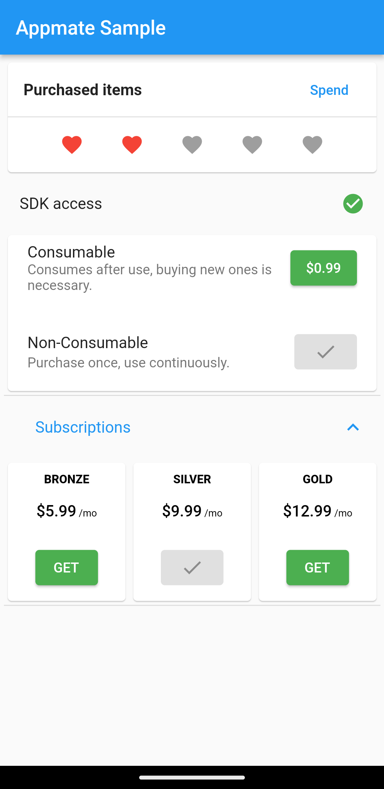

# appmate-sample

Appmate in-app-purchase SDK Kotlin and Flutter samples. The samples demonstrate how to integrate the SDK into applications to enable in-app purchases on multiple platforms.

## Setup

1. Create an application on Appmate console

### In the App
2. Add the API key to api.properties
3. [Sign the app](https://developer.android.com/studio/publish/app-signing#opt-out) and export a signed .abb/.apk (same key can be used for both HMS and GMS flavors)

### On the Store
4. Publish the app to a test channel in Google Play Store and/or AppGallery, stores may require a Privacy Policy
5. Setup Monetization in the stores
6. Create consumable, nonconsumable and subscription products

### Test
7. In Google Play Developer Console, add test users to License Testing
8. In AppGallery, add test users to Sandbox > Test accounts

> Test accounts may not be activated on Emulators, try with a real device.
